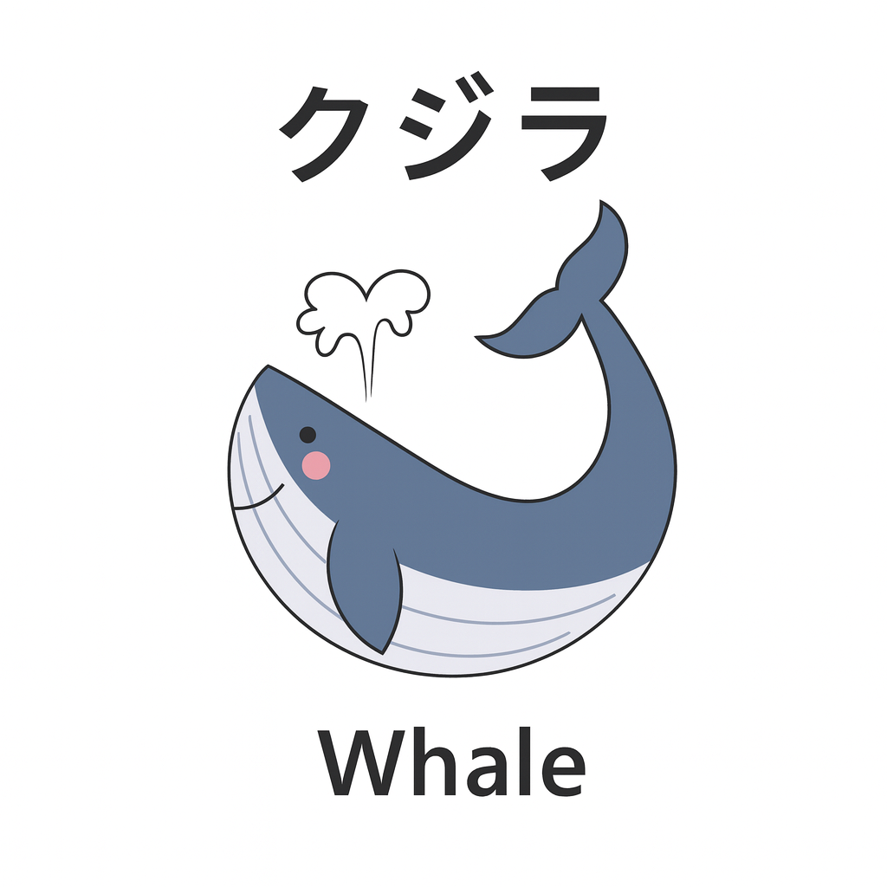

```
╭──────────────────────────────────────────────╮
│                                              │
│  A P P S                                     │
│  finance · docs · notes · tasks · passwords  │
│                                              │
╰──────────────────────────────────────────────╯
```

<p align="center">
  
</p>

<br>


> Personal and productivity applications — the day-to-day tools you actually
> open and use, each self-hosted so the data stays private and under your control.

**Running a stack** — every folder here is a self-contained Docker Compose stack:

```bash
cd <service>
cp docker-compose.example.yml docker-compose.yml
cp .env.example .env          # then edit the values
docker compose up -d
```

> Need Docker installed first? See [Requirements](../README.md#requirements).

New apps are added over time — the folders in this directory are the current list.

<sub><a href="../">← all services</a></sub>
