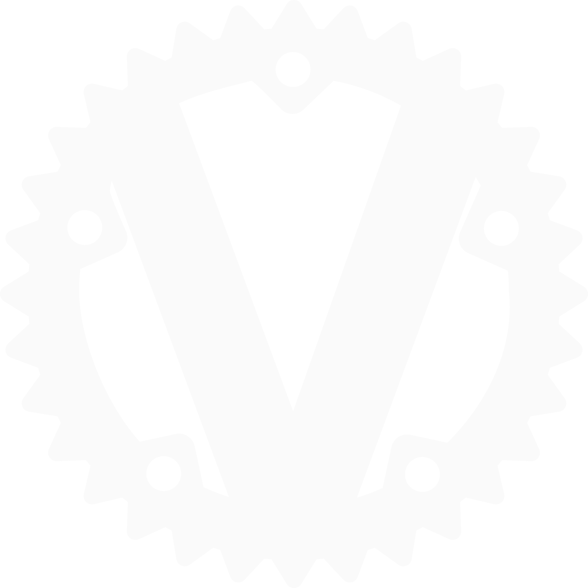

This directory contains an example deployment of Vaultwarden, a lightweight, open-source password manager server that is fully compatible with the official Bitwarden clients. Vaultwarden runs your own private vault on your own server: you keep logins, passwords, TOTP two-factor codes, passkeys, secure notes and file attachments in one end-to-end-encrypted place, and reach them through the same Bitwarden browser extensions, desktop and mobile apps you'd use with the commercial service. Because it's a re-implementation of the Bitwarden server in Rust, it's tiny and happy on modest hardware, while your encrypted data never leaves a machine you control.

  

 

## Official container image

https://github.com/dani-garcia/vaultwarden — image published as `vaultwarden/server`.

## Deployment Notes

- Runs as a single container — the server, web vault UI and its embedded SQLite database are all self-contained.
- Stores everything (the SQLite database, attachments, encryption keys) in a persistent Docker volume (`vaultwarden_data` at `/data`) that survives restarts and image upgrades.
- Exposes a single HTTP interface (container listens on port 80).
- **HTTPS is effectively required for real use:** the Bitwarden apps and browser extensions refuse to connect to a plain-HTTP server (except `localhost`), so put a reverse proxy (Caddy / Traefik / nginx) with TLS in front and point `DOMAIN` at the real `https://` address.
- Uses the image's built-in `/healthcheck.sh` rather than an assumed external HTTP client.
- Registration is gated by `SIGNUPS_ALLOWED` — leave it on to create your account(s), then turn it off so nobody else can register. The `/admin` panel is protected by `ADMIN_TOKEN`.
- Memory and CPU limits are set to keep it polite on a shared host (it barely needs them — Vaultwarden is very light).
- Environment-specific values (image tag, host port, domain, admin token) are externalized to a `.env` file.
- **Backups are simple:** everything lives in the `/data` volume, and the vault is a single SQLite database — snapshot the volume (or copy `db.sqlite3`) and you have a full backup.

## Example Use

Vaultwarden can be used to store and sync:

- website logins and passwords across all your devices
- TOTP / two-factor authentication codes and passkeys
- secure notes, cards and identities
- file attachments tied to vault entries
- shared credentials for a family or team via organizations and collections
- one-off encrypted text or files with others via Bitwarden "Send"

This gives you a private, self-hosted alternative to commercial password managers, using the polished official Bitwarden client apps.

## Thanks

Thanks to Daniel García (dani-garcia) and the Vaultwarden project for a fast, lightweight, genuinely private password-manager server that pairs perfectly with the Bitwarden ecosystem.

## Links

- Source: https://github.com/dani-garcia/vaultwarden
- Wiki / documentation: https://github.com/dani-garcia/vaultwarden/wiki
- Bitwarden clients: https://bitwarden.com/download
