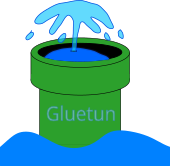

This directory contains a VPN hub: a self-hosted setup where a VPN gateway
container (gluetun) holds the tunnel, and other containers are routed so their
only path to the internet is through that tunnel. Transmission rides the hub as
the flagship service, and the same one-line pattern attaches any other container
you want to keep behind the VPN. If the tunnel drops, gluetun's kill-switch cuts
all traffic — a riding container can never leak your real IP.


<p align="center">
  
</p>

<br>


<p align="center">
  
</p>

<br>


## Official container images

- gluetun (VPN gateway): https://github.com/qdm12/gluetun
- Transmission: https://github.com/linuxserver/docker-transmission

## How it works

The trick is one Docker feature: **`network_mode: "service:gluetun"`**. A
container started this way does not get its own network — it **shares gluetun's
network namespace** (same interfaces, same IP, same routing). Since gluetun's
only route out is the VPN tunnel, every packet the riding container sends leaves
through the VPN. There is no separate "connect to the VPN" step in the other
service; it simply *is* gluetun on the network.

- **Kill-switch / no leak:** gluetun blocks everything that isn't the tunnel. If
  the VPN goes down, riding containers lose internet entirely (fail closed).
- **DNS:** resolves through the tunnel too, so no DNS leaks.
- **One IP:** gluetun + all riders appear on the internet as the single VPN IP.

## The ports caveat (read this)

A container using `network_mode: "service:gluetun"` **cannot declare its own
`ports:`** — it has no own network to publish on. So:

> Every web UI (Transmission's `9091`, and any other service's port) is published
> on the **gluetun** service, not on the service itself.

That's why Transmission has no `ports:` block and `9091:9091` lives under gluetun.

## Routing ANY other service through the hub

Three steps (there's a ready template at the bottom of the compose file):

1. Add `network_mode: "service:gluetun"` to the service.
2. Add `depends_on: { gluetun: { condition: service_healthy } }`.
3. Remove that service's `ports:` and publish them on **gluetun** instead.

That's it — the service now reaches the internet only through the VPN.

## LAN access

To open the web UIs from your own network, set `LAN_SUBNET` (e.g.
`192.168.1.0/24`) — it becomes gluetun's `FIREWALL_OUTBOUND_SUBNETS`. Without it
the kill-switch drops the reply packets and the UI looks unreachable even though
the container is up.

## Verify it actually goes through the VPN

Once running, check the public IP a riding container sees — it must be the VPN's,
not yours:

```bash
docker exec transmission sh -c "wget -qO- https://ipinfo.io/ip"
```

Compare it to your real IP (`curl ifconfig.me` on the host). They must differ.

## Restart coupling (known quirk)

If gluetun restarts (reconnects, updates), containers sharing its namespace can
lose networking until they're restarted too. If a rider goes offline after a
gluetun restart, `docker compose restart <service>` fixes it. (Autoheal setups
exist if you want it automatic.)

## Backups

Transmission's settings live in `${CONFIG_PATH}/transmission`; your downloads in
`${DOWNLOADS_PATH}`. gluetun is stateless (config is all in `.env`).

## Alternative: Transmission carries the VPN itself

If you'd rather have Transmission *be* the tunnel (no separate gluetun), use the
all-in-one image **`haugene/transmission-openvpn`**. Other services then ride it
with `network_mode: "service:transmission"` and the exact same rules above
(ports published on the transmission container, `depends_on` health, etc.).
gluetun is recommended here because it supports WireGuard, more providers, a
cleaner kill-switch, and keeps Transmission a plain, independently-updatable image.

## Links

- gluetun wiki (per-provider setup): https://github.com/qdm12/gluetun-wiki
- Transmission: https://transmissionbt.com
