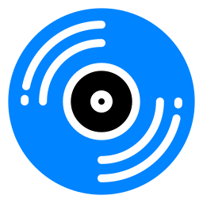

This directory contains an example deployment of Navidrome, a lightweight,
open-source music server and streamer for your own collection — think a private,
self-hosted Spotify for the music you actually own. Navidrome indexes a folder of
your audio files, reads their tags and cover art, and serves them through a clean
web player and, crucially, the **Subsonic API** — a standard supported by a whole
ecosystem of polished mobile and desktop clients. That means you can stream your
library anywhere and, with the right app, **download tracks and playlists for
offline listening** on the go, without burning mobile data. It's tiny, fast, and
your music never leaves your server.

  

 

## Official container image

https://github.com/navidrome/navidrome — image published as `deluan/navidrome`.

## Deployment Notes

- Runs as a single, very lightweight container (a Go binary — happy on minimal hardware).
- Uses **bind mounts**: `DATA_PATH` (its database and config, read/write) and your
  music library at `/music`, mounted **read-only** so Navidrome never touches your files.
- Runs as a fixed `user:` (UID:GID) — that user must own `DATA_PATH` and be able to
  read the music, so create the data folder and `chown` it before first start.
- Exposes a single HTTP interface on port `4533`, which serves **both** the web
  player **and** the Subsonic API that mobile apps connect to.
- Rescans the library on a schedule (`ND_SCANSCHEDULE`, 1h here).
- Includes a healthcheck against the web root; memory/CPU limits keep it polite.
- Environment-specific values (image, port, UID/GID, paths) are externalized to `.env`.
- **Backups:** the `DATA_PATH` folder holds the database (play counts, playlists,
  users) — back it up. Your music is already your own files.

## Recommended clients (offline download)

Because Navidrome speaks the Subsonic API, you get a large choice of apps that can
cache music for offline playback:

- **Android:** Symfonium (best-in-class, small paid app), Tempo, Substreamer, DSub
- **iOS:** Amperfy (free, open-source), play:Sub, substreamer
- **Desktop:** Feishin, Supersonic, Sonixd

## Example Use

Navidrome can be used to:

- stream your own music collection to phone, browser and desktop
- download albums/playlists to your phone for **data-free offline listening**
- keep playlists, favourites and play history across all your devices
- give family members their own accounts
- replace a music-streaming subscription with a private, self-hosted library

## Thanks

Thanks to Deluan and the Navidrome project for a fast, elegant, open-source music
server that pairs with the entire Subsonic app ecosystem.

## Links

- Source: https://github.com/navidrome/navidrome
- Website: https://www.navidrome.org
- Subsonic apps: https://www.navidrome.org/docs/overview/#apps
